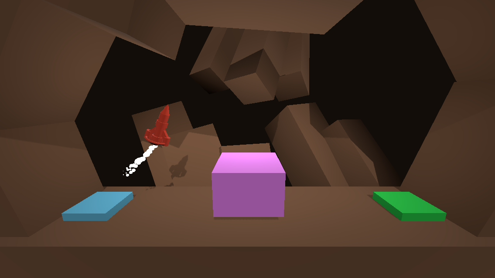

# 🚀 Project Boost 3D

A physics-based 3D platformer built with **Godot Engine 4**. The goal is to pilot a rocket-powered ship from a launch pad to a landing zone, navigating through obstacles using thrust and rotation mechanics.

## 🎮 How to Play

The ship is heavy and momentum-based. You must carefully balance your thrust against gravity to avoid crashing.

| Action | Input / Key |
| :--- | :--- |
| **Thrust (Fly Up)** | `Spacebar` |
| **Rotate Left** | `A` or `Left Arrow` |
| **Rotate Right** | `D` or `Right Arrow` |
| **Exit Game** | `Esc` |

**Objective:** Land safely on the **Green Pad**.
**Fail Condition:** Hitting the ground, walls, or any moving obstacle (Red objects) will destroy the ship.

## 🛠️ Technical Implementation

This project was developed focusing on **Godot 4 best practices** and clean architecture.

### Key Features
* **Physics-Based Movement:** The player controller extends `RigidBody3D`, using `apply_central_force` and `apply_torque` within `_physics_process` for smooth, framerate-independent movement.
* **Decoupled Logic:** Collision handling relies on **Groups** (`"Hazard"`, `"Goal"`) rather than hard-coded node names. This allows for scalable level design.
* **Tween Animations:** Obstacles and level transitions use `Tweens` for smooth interpolation, replacing legacy `AnimationPlayer` workflows for simple movements.
* **Modular Scene Structure:** The project uses nested `Node3D` containers (`Geometry`, `Lighting`, `Traps`) to keep the Scene Tree organized and readable.
* **Visual Feedback:** Extensive use of `GPUParticles3D` for engine thrust and explosion effects.

